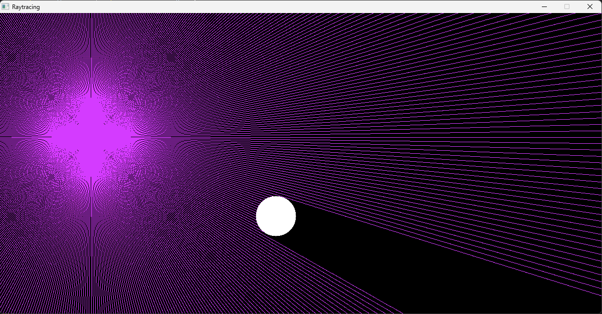
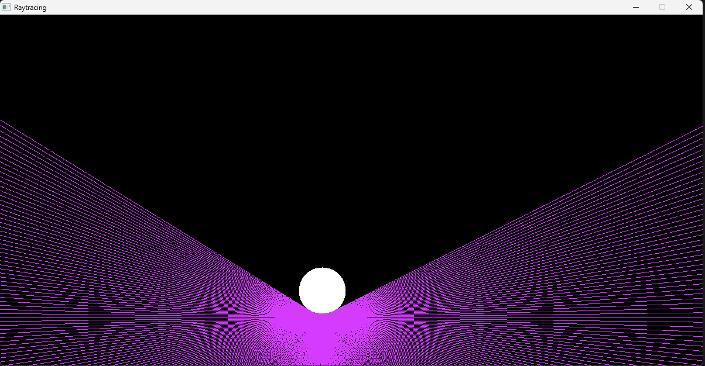

# Raytracing Visualization

A real-time raytracing simulation that visualizes light rays interacting with dynamic obstacles in a 2D environment using SDL2. The app allows users to adjust the ray source and observe the behavior of rays as they collide with moving obstacles.

## Features

- **Real-time Raytracing:** Rays are generated from a central source and interact with obstacles in the scene.
- **Interactive Simulation:** Users can move the ray source with the mouse and watch the rays react with obstacles.
- **Dynamic Obstacles:** Obstacles move within the environment, affecting how rays are reflected or blocked.

## Screenshots

*Raytracing visualization with moving obstacles.*

*Interactive ray source with real-time ray rendering.*
